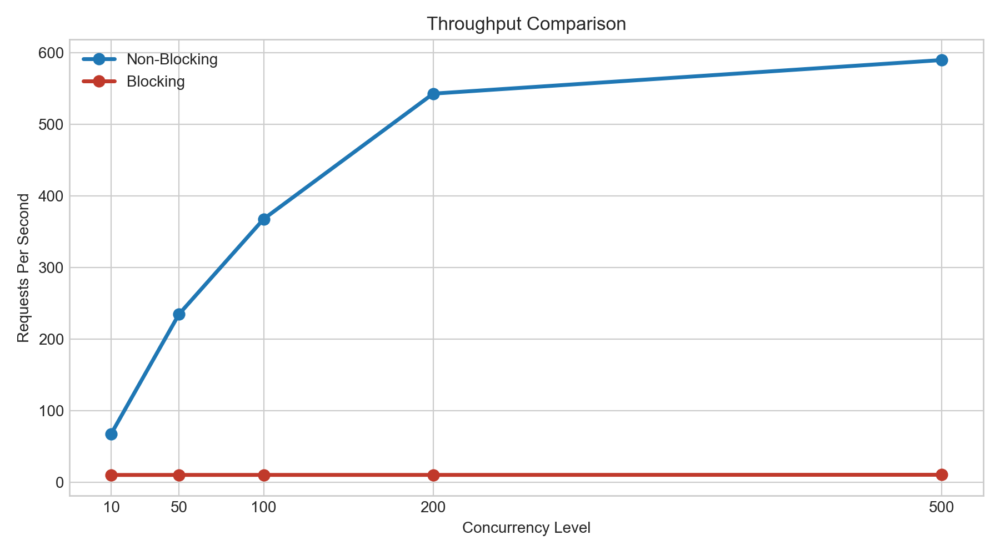
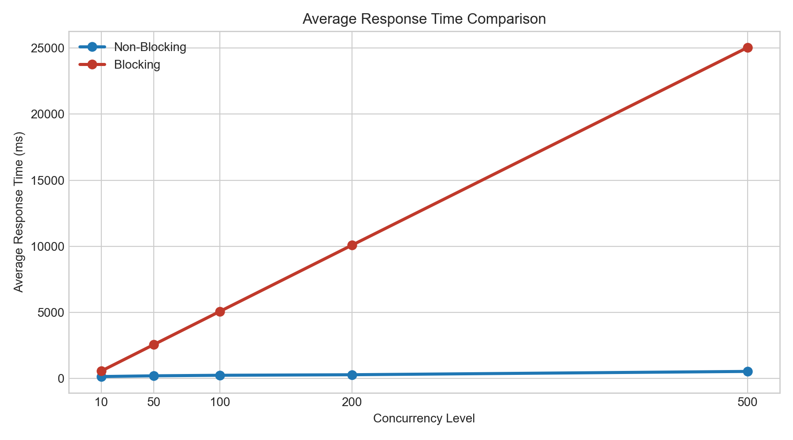
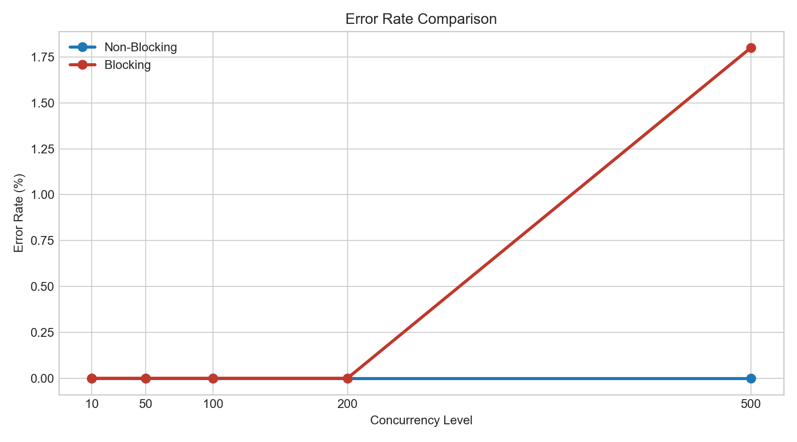

# Parallel Web Server Load Simulation and Optimization

## Project Purpose
This project compares two request handling approaches in a Node.js web server under concurrent load:

1. Synchronous blocking model
2. Asynchronous non-blocking model

The server is tested by a Python `asyncio` load generator that sends many concurrent HTTP requests and records performance metrics such as throughput, response time, and error rate.

## Technologies Used
- Node.js
- Express.js
- Python 3
- `asyncio`
- `aiohttp`
- Docker
- Docker Compose

## Blocking vs Non-blocking
The `/blocking` endpoint performs CPU-bound busy work on the main thread. While that work is running, the Node.js event loop is blocked, so other requests must wait.

The `/non-blocking` endpoint simulates an I/O wait by using `await` with a timer. During that wait, the event loop is free to accept and process other requests.

Because of this difference, the asynchronous non-blocking model usually performs better under high concurrency.

## Project Structure
```text
parallel-web-server-load-simulation/
├── server/
│   ├── server.js
│   ├── package.json
│   └── Dockerfile
├── load_tester/
│   ├── load_test.py
│   ├── requirements.txt
│   └── Dockerfile
├── results/
│   └── test_results.csv
├── docker-compose.yml
├── README.md
└── report.md
```

## API Endpoints
- `GET /health`
  Returns a simple health response for Docker and manual checks.

- `GET /blocking`
  Simulates synchronous blocking work on the Node.js main thread.

- `GET /non-blocking`
  Simulates asynchronous non-blocking waiting without freezing the event loop.

Both test endpoints also accept an optional `delayMs` query parameter. Example:

```text
http://localhost:3000/blocking?delayMs=100
http://localhost:3000/non-blocking?delayMs=100
```

## Docker Run Steps
### 1. Build and start only the server
```bash
docker compose up --build -d server
```

### 2. Run the load test
```bash
docker compose run --rm load_tester
```

### 3. Stop containers
```bash
docker compose down
```

The CSV results are written to:

```text
results/test_results.csv
```

You can also run everything with a single PowerShell command:

```powershell
.\run_project.ps1 -UseDocker
```

## Manual Run Steps
### 1. Start the Node.js server
```bash
cd server
npm install
npm start
```

### 2. Run the Python load tester in a new terminal
```bash
python -m pip install -r load_tester/requirements.txt
python load_tester/load_test.py
```

If you are using PowerShell:

```powershell
python -m pip install -r .\load_tester\requirements.txt
python .\load_tester\load_test.py
```

For the easiest Windows flow, run everything with:

```powershell
.\run_project.ps1
```

Useful options:

```powershell
.\run_project.ps1 -SkipInstall
.\run_project.ps1 -DelayMs 200
.\run_project.ps1 -UseDocker
```

## Visual Comparison
After the load test finishes, you can generate comparison charts with:

```bash
python analyze_results.py
```

This creates the following files inside `results/`:

- `throughput_comparison.png`
- `average_response_time_comparison.png`
- `error_rate_comparison.png`

## Benchmark Visuals
The following charts were generated from the latest benchmark results in `results/test_results.csv`.

### Throughput Comparison


### Average Response Time Comparison


### Error Rate Comparison


## Comparison Summary
The charts show a clear performance difference between the two request handling models.

In the throughput chart, the non-blocking model scales much better as concurrency increases. At 500 concurrent users, the non-blocking endpoint reaches about `720.45 req/s`, while the blocking endpoint stays around `10.17 req/s`. This means the asynchronous model can continue handling new requests much more effectively under heavy load.

In the average response time chart, the blocking model becomes dramatically slower as concurrency rises. At 10 users, the blocking endpoint already averages about `567.08 ms`, and by 500 users it increases to about `25308.04 ms`. In contrast, the non-blocking endpoint remains much lower, rising from about `127.49 ms` to `422.31 ms`.

In the error rate chart, the non-blocking model keeps a `0.0%` error rate across all tested concurrency levels. The blocking model also stays at `0.0%` until the heaviest test, but at 500 users its error rate rises to `2.6%`. This indicates that the blocking model begins to fail under sustained high concurrency.

Overall, the visual results support the expected conclusion: the asynchronous non-blocking model performs better under concurrent load because it does not keep the event loop busy while waiting. The blocking model occupies the event loop for each request, which increases queueing delay, raises response time, limits throughput, and eventually causes failures at higher load levels.

## How the Load Test Works
The load tester runs both endpoints separately for these concurrency levels:

- 10 users
- 50 users
- 100 users
- 200 users
- 500 users

To keep the measurements cleaner, the tester:

- runs the non-blocking endpoint before the blocking endpoint
- sends one warm-up request before each endpoint group
- waits briefly between scenarios
- uses a larger timeout automatically for heavy blocking scenarios

For each test, one request is created per virtual user at the same time. The tool records:

- endpoint
- concurrency level
- total requests
- successful requests
- failed requests
- average response time
- minimum response time
- maximum response time
- throughput
- error rate

## How to Read the Results
- `endpoint`: Which server model was tested.
- `concurrency_level`: Number of simultaneous virtual users.
- `total_requests`: Total requests sent in that scenario.
- `successful_requests`: Requests that returned HTTP 200.
- `failed_requests`: Requests that timed out, errored, or returned a non-200 response.
- `average_response_time_ms`: Mean latency in milliseconds.
- `minimum_response_time_ms`: Fastest response in milliseconds.
- `maximum_response_time_ms`: Slowest response in milliseconds.
- `throughput_rps`: Completed requests per second.
- `error_rate_percent`: Failure percentage.

Expected interpretation:

- The blocking model usually shows increasing response time and lower throughput as concurrency rises.
- The non-blocking model usually keeps better throughput and lower latency under the same conditions.
- If error rate rises, the system is struggling to handle that load level.
